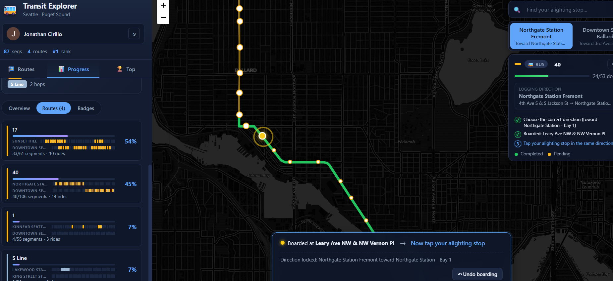

# Transit Explorer 🚌

[](https://github.com/cirillojon/transit-explorer/actions/workflows/ci.yml)
[](https://github.com/cirillojon/transit-explorer/actions/workflows/fly-deploy.yml)
[](https://transit-explorer.org/)
[](https://transit-explorer.fly.dev/api/health)

> A gamified transit map for Seattle. Ride a bus or train, mark the segment
> you traveled, and watch the network fill in. Earn achievements, climb the
> leaderboard, and discover the corners of the system you've never been on.

🌐 **Live at:** <https://transit-explorer.org/>



---

## What it is

Transit Explorer turns riding transit into an exploration game. Pick a route,
tap your boarding stop, tap your ending stop — the segment lights up on
your personal map. Over time you can see exactly which parts of the network
you've ridden, and which you still haven't.

It runs on real OneBusAway data for the Puget Sound region (Seattle, King
County Metro, Sound Transit, Community Transit, and friends), and is built to
stay essentially free to host.

---

## Features

- 🗺️ **Interactive map** of every route in the OneBusAway dataset, with
  per-direction polylines and stops.
- 👆 **Tap-to-log rides** — mark the boarding stop, tap the ending stop,
  and the segment is saved to your account.
- 📈 **Per-route progress** — completion bars, recent activity feed, and a
  14-day rides sparkline.
- 🏆 **Achievements & leaderboard** — unlockable badges plus all-time / weekly
  / monthly rankings, with public profiles you can link to friends.
- 📱 **Mobile-first UX** — collapsible legend, safe-area aware overlays,
  one-tap stop search, and dismissible widgets so the map is always usable.
- 🔐 **Google sign-in** via Firebase Auth — no passwords to manage.

---

## Tech stack

| Layer    | Tech                                                                      |
| -------- | ------------------------------------------------------------------------- |
| Frontend | React · Vite · React-Leaflet · Firebase Auth (Google sign-in)             |
| Backend  | Python · Flask · SQLAlchemy · Flask-Migrate · gunicorn                    |
| Data     | [OneBusAway](https://onebusaway.org/) regional API                        |
| Storage  | SQLite on a mounted volume (Postgres-ready via `SQLALCHEMY_DATABASE_URI`) |
| Hosting  | Vercel (frontend) · Fly.io (backend) · Firebase (auth)                    |
| CI/CD    | GitHub Actions → Fly deploy · Vercel auto-deploy on push                  |

---

## Quick start (local dev)

> Need an [OneBusAway API key](https://onebusaway.org/contact/) and a
> Firebase project with Google sign-in enabled.

```bash
# 1. Clone
git clone https://github.com/cirillojon/transit-explorer.git
cd transit-explorer

# 2. Backend (Docker)
cp .env.example .env                   # then fill in OBA_API_KEY, Firebase IDs
#   Drop your Firebase service-account JSON next to .env as service-account.json
./dev_container_update.sh 8880         # → http://localhost:8880

# 3. Frontend
cd tm-frontend
cp .env.example .env                   # then fill in VITE_FIREBASE_* values
npm install
npm run dev                            # → http://localhost:5173
```

A pure-Python (no Docker) backend workflow, the full `.env` reference, and the
deployment story are documented separately:

- 🛠️ **[docs/DEVELOPMENT.md](./docs/DEVELOPMENT.md)** — daily dev loop, deploys,
  database migrations, troubleshooting cheat sheet.
- 🚀 **[docs/DEPLOYMENT.md](./docs/DEPLOYMENT.md)** — first-time Fly + Vercel
  setup checklist.
- 🩹 **[docs/TROUBLESHOOTING.md](./docs/TROUBLESHOOTING.md)** — emergency
  procedures, log inspection, backup/restore.
- 📐 **[docs/ARCHITECTURE.md](./docs/ARCHITECTURE.md)** — system architecture,
  full env-var reference, REST API table, repository layout, security notes.
- 🤝 **[CONTRIBUTING.md](./CONTRIBUTING.md)** — contributor setup, branch
  workflow, test commands.

> On a fresh local DB, `/api/health` returns before the OneBusAway import
> finishes. Give the route list 1–3 minutes to fully populate while the
> background loader catches up.

---

## Project layout (high level)

```
transit-explorer/
├── app/              # Flask backend (models, routes, OBA loader)
├── tm-frontend/      # React + Vite SPA
├── docs/             # Architecture, deployment, dev, troubleshooting
├── README.md         # You are here
├── Dockerfile        # Backend image
├── docker-compose.yml
└── fly.toml          # Fly.io config
```

A more detailed file-by-file map lives in
[docs/ARCHITECTURE.md](./docs/ARCHITECTURE.md#repository-layout).

---

## Contributing

Issues and pull requests are welcome — see
[CONTRIBUTING.md](./CONTRIBUTING.md) for setup, branch flow, and test commands.

For the deployment / migration workflow, see
[docs/DEVELOPMENT.md](./docs/DEVELOPMENT.md).

---

## Acknowledgements

- [OneBusAway](https://onebusaway.org/) for the open transit data.
- [CARTO](https://carto.com/) for the basemap tiles.
- [Leaflet](https://leafletjs.com/) and
  [react-leaflet](https://react-leaflet.js.org/).

---

## License

This project is licensed under the PolyForm Noncommercial 1.0.0 license.

You may use, modify, and share this software for noncommercial purposes only. Commercial use is not permitted without prior written permission from the copyright holder.

See the **[LICENSE](LICENSE)** file for details.

For commercial licensing inquiries, contact cirillojon
